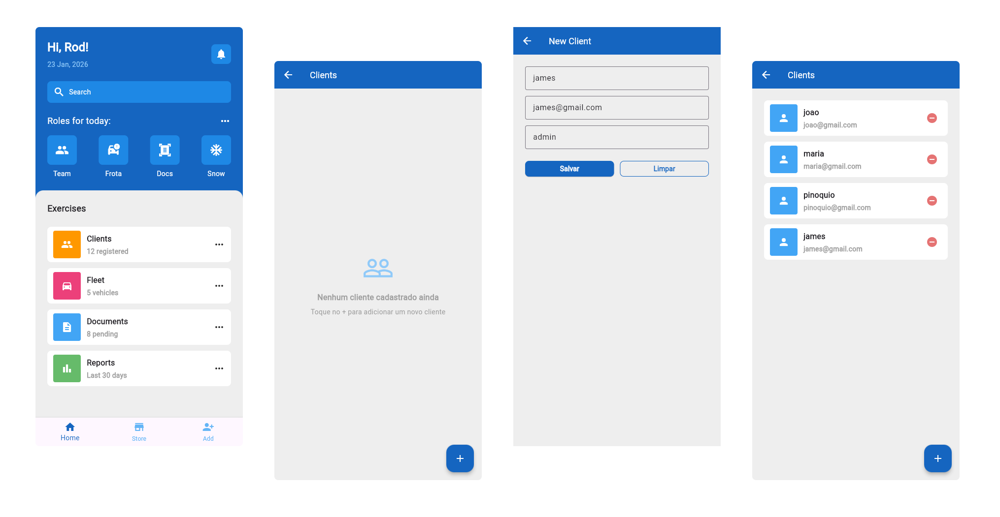

**App Flutter para gerenciamento de clientes (CRUD completo)**

App Flutter para cadastro, edição e remoção de clientes via API REST, construído com gerenciamento de estado reativo inteiramente nativo do Flutter sem utilizaçaõ de pacotes para gerenciamento de estado como Provider, Riverpod ou Bloc.

O contexto do App é o de uma interface mobile para um sistema de gestão de clientes, conectada a um backend Dart rodando localmente. O App foi desenvolvido seguindo uma **arquitetura em camadas inspirada em MVVM + Redux**, separando a responsabilidades entre Entities, DTOs, Services e Pages.

---

### 1. Sobre o projeto

O App nasceu da necessidade de ter uma interface mobile para gerenciar clientes de forma simples e intuitiva, conectada a uma API REST. As funcionalidades cobrem o ciclo completo de CRUD:

- Listagem de clientes
- Criação de novos clientes
- Edição de clientes existentes
- Remoção direta da lista

<p align="center">
  
</p>

---

### 2. Rode esse projeto

Siga estes passos para iniciar o projeto localmente:

**a) Clone o repositório**

```bash
git clone git@github.com:RodrigoBerino/clientValitation.git
```

**b) Comandos**

```bash
cd clientserver

flutter pub get

flutter run -d web-server
```

---

### 3. Diagrama de classes

Abaixo o diagrama do projeto para uma visão sistematica e arquitetural do que foi construído:

<p align="center">
  
</p>

---

### 4. Tecnologias utilizadas

- Flutter
- Dart
- Material Design 3
- MVVM + Redux
- Sealed classes para estados exaustivos
- Gerenciamento de estado reativo com `ValueNotifier`
- `ListenableBuilder` para rebuilds reativos
- Mixins para validações reutilizáveis
- HTTP REST (`http: ^1.2.0`)

---

### 5. Créditos

[Referência baseada em projeto Open do Dribbble](https://dribbble.com/shots/15002657-Mental-Health-App)
